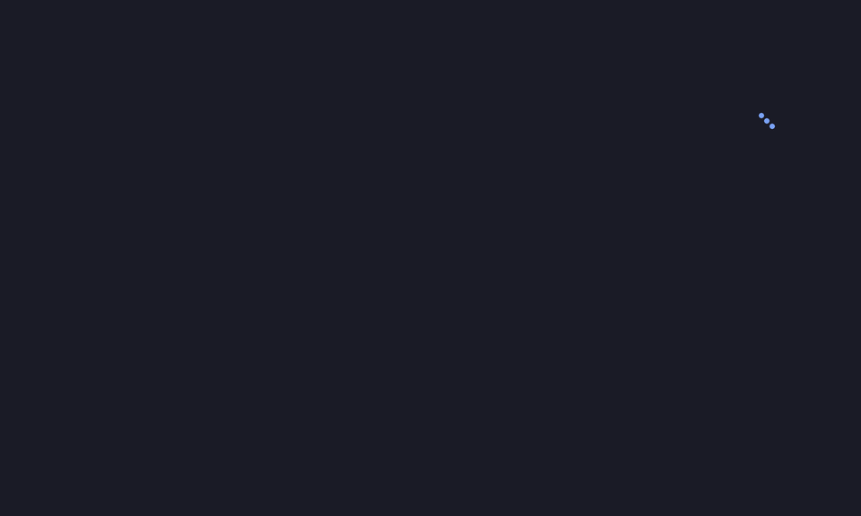
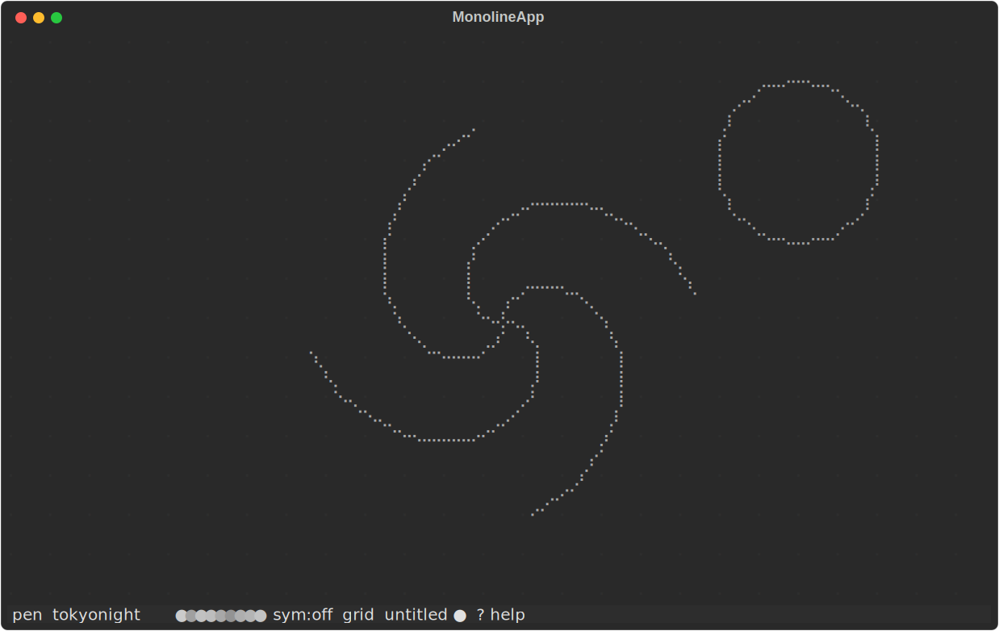
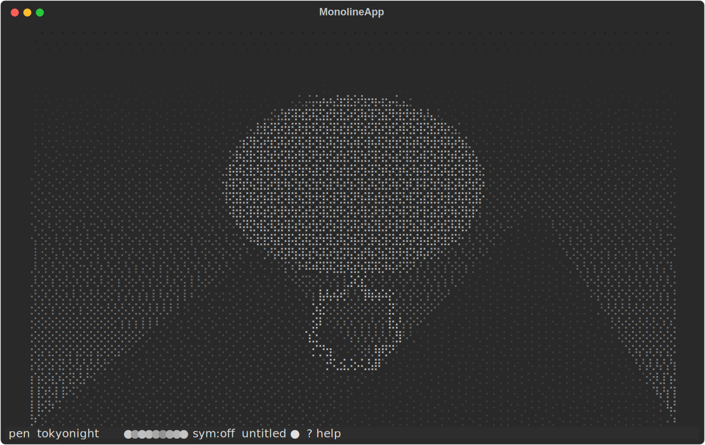
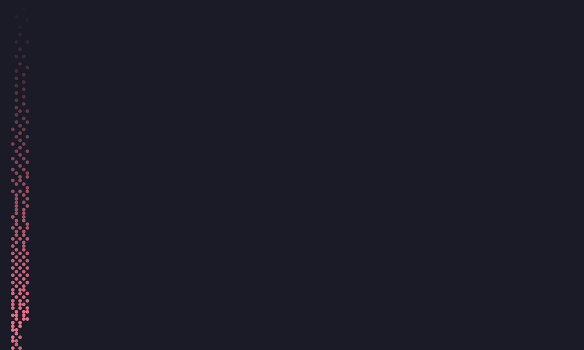

# monoline

Aesthetic drawing in your terminal — smooth braille strokes, tldraw-style
shape correction, curated palettes, symmetry, and a dot grid.

[](https://github.com/ByapakSigdel/monoline/actions/workflows/ci.yml)



*Freehand drawing with live smoothing — hold **Ctrl** and a rough circle
snaps to a perfect one; symmetry mirrors strokes as you draw.*

| | |
|---|---|
|  |  |

## Install

    pip install monoline    # or: pipx install monoline / uv tool install monoline

## Quick start

    monoline                    # start on a blank canvas
    monoline drawing.mono.json  # open (or create) a named drawing

Click and drag with the mouse to draw. Hold Ctrl while dragging to snap the
stroke to a line, circle, ellipse, or rectangle. Press `?` any time for the
in-app cheat sheet, `c` to clear, `q` to quit.

## Keymap

| Keys | Action |
| --- | --- |
| drag | draw |
| Ctrl+drag | snap to shape (line / circle / ellipse / rect) |
| `d` / `e` | pen / eraser |
| `1`-`9` | pick color |
| `p` / `P` | next / previous palette |
| `s` | cycle symmetry (off → vertical → horizontal → radial4) |
| `g` | toggle dot grid |
| `u` / Ctrl+Z | undo |
| `r` / Ctrl+Y | redo |
| Ctrl+S | save |
| `x` | export (`.txt` = ANSI, `.svg` = SVG) |
| `i` | import image (path prompt) |
| `v` | paste image from clipboard |
| `c` | clear the canvas (asks to confirm) |
| `?` | this help overlay (escape or `?` to close) |
| `q` | quit (asks to confirm if there are unsaved changes) |

## Import images

Drop any image file onto the terminal (or press `i` for a path prompt,
`v` to paste one from the clipboard, or run `monoline photo.png`) and it
becomes braille art you can draw over — Floyd-Steinberg dithered, with
24-bit color per cell. A braille cell's eight dots share one color, so
chroma resolution is per-cell: that's the medium, not a bug. Erasing over
an image hides its dots non-destructively; undo brings the import back.

On Linux, clipboard paste needs `xclip` (X11) or `wl-clipboard` (Wayland).



## Palettes

Cycle through with `p` / `P`, or set a default in the config file:

- `tokyonight` (default)
- `catppuccin`
- `gruvbox`
- `nord`
- `pastel`
- `neon`
- `mono`

## Configuration

monoline reads a TOML config file on startup, creating it with defaults on
first run:

- Linux: `~/.config/monoline/config.toml`
- macOS: `~/Library/Application Support/monoline/config.toml`
- Windows: `%LOCALAPPDATA%\monoline\monoline\config.toml`

```toml
# monoline configuration
shape_correct = "ctrl"   # ctrl | always | off
palette = "tokyonight"   # see the palette list above
smoothing = 0.5           # 0.0 - 1.0
```

- `shape_correct` — when Ctrl+drag snaps to a recognized shape. `"ctrl"`
  (default) snaps only while Ctrl is held; `"always"` snaps every stroke
  without needing Ctrl (useful if your terminal swallows Ctrl+drag);
  `"off"` disables shape recognition entirely.
- `palette` — the color palette to load on startup. Overridden automatically
  when opening a saved file that recorded a different palette.
- `smoothing` — how much Chaikin smoothing/resampling is applied to freehand
  strokes, from `0.0` (raw mouse samples) to `1.0` (maximally smoothed).

## File formats

- **`.mono.json`** — monoline's native format: versioned JSON containing
  canvas size, background, palette, and every stroke. Fully reopenable and
  editable — this is what Ctrl+S saves.
- **`.txt` (ANSI)** — a plain-text export with embedded truecolor ANSI escape
  codes. `cat` it in any truecolor-capable terminal to see the drawing.
- **`.svg`** — a vector export of the strokes, suitable for viewing in a
  browser or editing in a vector graphics tool.

Pick the format by the extension you type when exporting with `x`.

## Terminal support

monoline draws with Unicode braille characters and needs mouse reporting, so
your terminal matters:

- **Windows**: use [Windows Terminal](https://aka.ms/terminal). The legacy
  `conhost.exe` console does not support the mouse reporting monoline needs
  for drawing.
- **Font**: pick a braille-capable monospace font — Cascadia Code/Mono,
  any [Nerd Font](https://www.nerdfonts.com/), or the default monospace font
  on macOS/Linux all work.
- **Ctrl+drag not registering?** Some terminal emulators swallow the Ctrl
  modifier on mouse drags. If shape snapping never triggers, set
  `shape_correct = "always"` (snap every stroke) or `"off"` (disable it) in
  your config file.

## License

MIT
